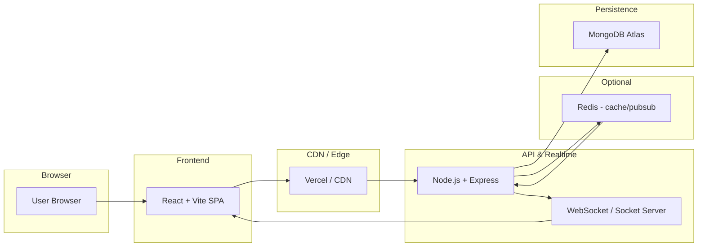

# DevTrack

DevTrack

DevTrack is a modern full-stack Task & Project Management application (Node.js + Express backend, React + Vite frontend). It helps teams and individuals create, track and collaborate on projects and tasks with role-based views and realtime updates.


## 🌐 Live Demo

- **Frontend:** https://example-frontend.example.com
- **Backend API:** https://devtrack-k1q5.onrender.com
- **GitHub Repository:** https://github.com/your-org/DevTrack

---

## ✨ Features

### 🔐 Authentication & Security

* User Registration
* User Login
* JWT Authentication
* Protected Routes
* Password hashing (bcrypt)
* Helmet, CORS and rate-limiting middleware

### 📋 Project & Task Management

* Create / Update / Delete Projects
* Create / Update / Delete Tasks
* Assign tasks to users
* Toggle task status (Pending / In Progress / Done)
* Task ownership and user isolation

### 📊 Productivity

* Search tasks
* Filter by status or assignee
* Pagination
* Responsive dashboards for Admin / Manager / Employee
* Realtime UI updates (WebSocket)

---

## 🛠️ Tech Stack

### Frontend

* React, Vite
* React Router, Axios
* React Toastify, CSS

### Backend

* Node.js, Express
* MongoDB, Mongoose
* WebSocket for realtime updates

### Security

* JWT, bcrypt
* Helmet, express-rate-limit, CORS

### Deployment

* Frontend: Vercel (recommended)
* Backend: Render / Heroku / VPS
* Database: MongoDB Atlas

---


## 🏗️ System Architecture
A concise, production-ready architecture overview showing components, responsibilities, and data flow.



Component responsibilities

- Frontend (`React + Vite`): UI, client-side routing, input validation, and realtime update rendering.
- CDN / Edge (`Vercel`): fast static asset delivery, edge caching, and deployment surface for the SPA.
- Backend (`Node.js + Express`): REST API, authentication/authorization, business logic, and integration with DB and cache.
- WebSocket / Socket Server: realtime events (task updates, notifications, presence), can run co-located with the API or as a separate service.
- Data store (`MongoDB Atlas`): primary persistence for users, projects, tasks and history.
- Cache / PubSub (`Redis`, optional): request caching, rate limits, and pub/sub for scaling realtime across multiple backend instances.

Deployment & scaling notes

- Run the frontend on Vercel (or equivalent CDN) for global edge delivery.
- Host the API on Render, Heroku, or any container platform behind a load balancer (use multiple instances for horizontal scaling).
- Use managed MongoDB Atlas with a production replica set and backups.
- Add Redis for shared caches and pub/sub when scaling WebSocket across nodes.

Security & resilience

- Enforce HTTPS everywhere; use strong `JWT_SECRET` and short-lived tokens with refresh flows.
- Apply rate limiting, Helmet, and CORS policies at API layer.
- Validate and sanitize all inputs; use parameterized queries with Mongoose.
- Monitor health, set up automated backups, and configure alerting (errors, high latency, DB replication lag).

---

## 📂 Project Structure

```text
DevTrack
│
├── Backend
│   ├── src
│   │   ├── config
│   │   ├── controllers
│   │   ├── middleware
│   │   ├── models
│   │   ├── routes
│   │   └── socket
│   ├── index.js
│   └── package.json
│
├── Frontend
│   ├── src
│   │   ├── api
│   │   ├── components
│   │   ├── pages
│   │   ├── styles
│   │   └── main.jsx
│   └── package.json
│
├── screenshots
└── README.md
```

---

## 🔗 API Endpoints (examples)

### Authentication

| Method | Endpoint | Description |
| ------ | -------: | ----------- |
| POST | `/api/auth/register` | Register user |
| POST | `/api/auth/login` | Login / get JWT |

### Projects & Tasks

| Method | Endpoint | Description |
| ------ | -------: | ----------- |
| GET | `/api/projects` | List projects for user |
| POST | `/api/projects` | Create project |
| GET | `/api/tasks` | List tasks for user |
| POST | `/api/tasks` | Create task |
| PUT | `/api/tasks/:id` | Update task |
| DELETE | `/api/tasks/:id` | Delete task |

---

## ⚙️ Local Installation

### Clone

```bash
git clone https://github.com/your-org/DevTrack.git
cd DevTrack
```

### Backend

```bash
cd Backend
npm install
```

Create `.env` in `Backend/`:

```env
MONGO_URI=your_mongodb_connection_string
JWT_SECRET=your_jwt_secret
PORT=3000
CLIENT_URLS=http://localhost:5173
```

Start backend:

```bash
npm run dev
```

### Frontend

```bash
cd Frontend
npm install
```

Create `.env` in `Frontend/` (Vite):

```env
VITE_API_BASE_URL=http://localhost:3000/api
VITE_SOCKET_URL=http://localhost:3000
```

Start frontend:

```bash
npm run dev
```

### Production frontend values

If you deploy the frontend separately, set these environment variables in Vercel or your hosting provider:

```env
VITE_API_BASE_URL=https://devtrack-k1q5.onrender.com/api
VITE_SOCKET_URL=https://devtrack-k1q5.onrender.com
```

For the backend on Render, make sure `CLIENT_URLS` includes your deployed frontend URL, for example:

```env
CLIENT_URLS=https://your-frontend-domain.com,http://localhost:5173
```

Open: `http://localhost:5173`

---

## 🎯 Learning Outcomes

* Full-stack MERN development
* Authentication & secure APIs
* Realtime updates and WebSockets
* Deployment to Vercel / Render

---

## 🚀 Future Enhancements

* Dark Mode
* Drag & Drop Kanban
* Team & Role Management
* Notifications & Reminders
* Analytics Dashboard

---

## 👨‍💻 Author

G. Shiva Kumar — Aspiring Full-Stack Developer

**GitHub:** https://github.com/Shiva132007
**LinkedIn:** https://www.linkedin.com/in/shivakumargolladasari

---

## 📄 License

This project currently has no license. Add a `LICENSE` file if you want to make the license explicit.

---

